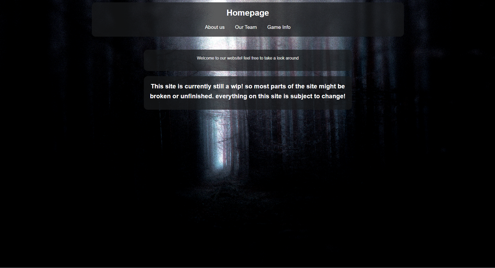
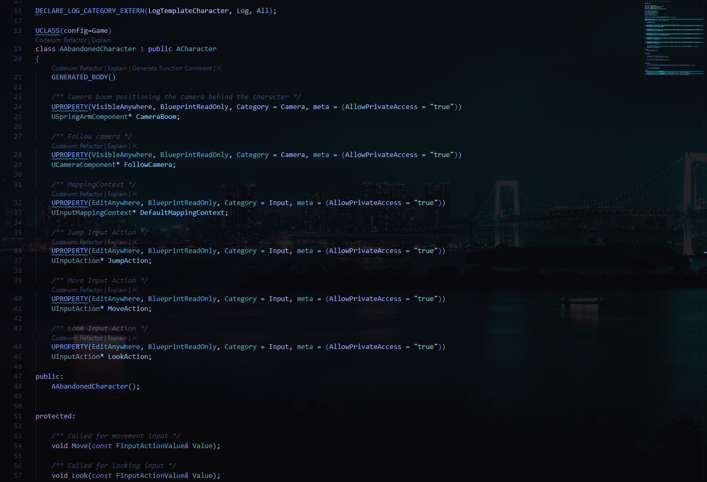

  

## 👨‍💻 About Me

I'm a passionate developer with interests in game development, software engineering, and creative coding. I enjoy building interactive experiences and solving complex problems through code.

- 🔭 **Currently working on:** Abandoned: The Asylum of Madness
- 🌱 **Learning:** Unreal Engine, Blender, HTML/CSS, C# and C++
- 💬 **Ask me about:** HTML, Game Development, .NET, or anything tech-related!
- 🎮 **Hobbies:** Video Games, Game Design, Programming, etc.

## 🚀 Featured Projects

<table>
  <tr>
    <td width="50%">
      <h3 align="center">Twisted Creations Website</h3>
      

        
        

          A collaborative project website for Twisted Creations. Built with modern web technologies to showcase our team's projects and creative work.
        

      

    </td>
    <td width="50%">
      <h3 align="center">Tokyo Night Dark Enhanced VS Code Theme</h3>
      

        
        

          A custom VS Code theme based on the popular Tokyo Night Dark palette with enhanced syntax highlighting and improved contrast. Created using VS Code's theming API and published to the VS Code Marketplace.
        

      

    </td>
  </tr>
</table>

## 🛠️ Tech Stack

### Languages

  

### Tools & Environments

  

### Design & Creative

  

### Frameworks & Platforms

  

## 📊 GitHub Stats

  
  

## 🏆 GitHub Trophies

  

## 📫 Connect With Me

  <!-- Add your social media links with icons -->
  
  <!-- Add more social links as needed -->
  <!-- Example:
  
  -->

---

  

<!--
You can customize this README further by:
1. Adding your actual project screenshots and links
2. Filling in the "About Me" section with your personal details
3. Adding your social media links
4. Customizing colors and themes to match your style
-->
